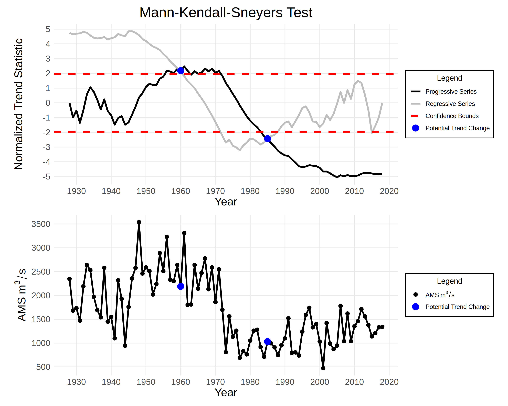
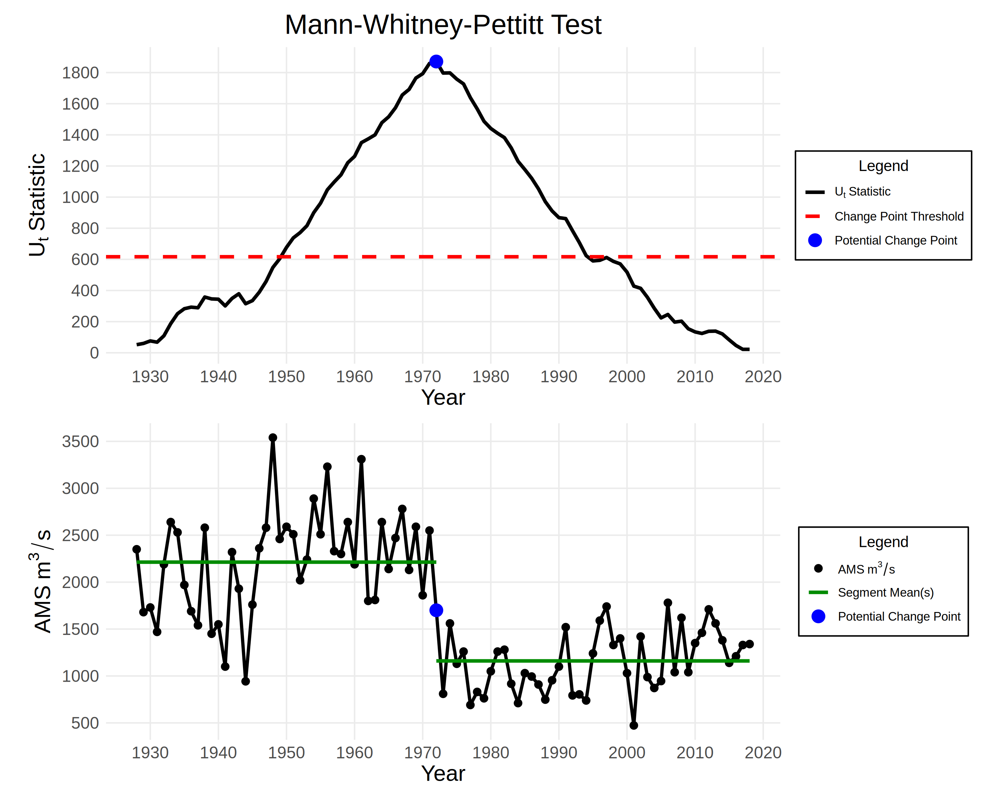

# Change Point Detection

## Mann-Kendall-Sneyers Test

The **Mann-Kendall-Sneyers (MKS) Test** is used to identify the beginning of a trend in a time series:

- Null hypothesis: There are no change points in the time series.
- Alternative hypothesis: There are _one or more_ change points in the time series.

Define $\mathbb{I}(y_{i} > y_{j})$ to be $1$ if $y_{i} > y_{j}$ and $0$ otherwise.

Given a time series $y_{1}, \dots, y_{n}$, we compute the *progressive series* $S^{F}_{t}$:

$$
S^{F}_{t} = \sum_{i=i}^{t} \sum_{j=1}^{i-1} \mathbb{I}(y_{i} > y_{j})
$$

Next, we reverse the time series $y$.
This gives us a new time series $y'$ such that $y_{i}' = y_{n+1-i}$. 
Then we compute the *regressive series* $S^{B}_{t}$, where $\text{rev}$ indicates that the vector is reversed:

$$
S^{B}_{t} = \text{rev}\left( \sum_{i=i}^{t} \sum_{j=1}^{i-1} \mathbb{I}(y'_{i} > y'_{j})\right)
$$

Then, we compute the _normalized progressive series_ $UF_{t}$ and _normalized regressive series_ $UB_{t}$:

$$
UF_{t} = \frac{S^{F}_{t} - \mathbb{E}[S^{F}_{t}]}{\sqrt{\text{Var}\,(S^{F}_{t})}}, \quad
UB_{t} = \frac{S^{B}_{t} - \mathbb{E}[S^{B}_{t}]}{\sqrt{\text{Var}\,(S^{B}_{t})}}
$$

For both the progressive and regressive series, the expectation and variance is as follows:

$$
\mathbb{E}[S^{F}_{t}] = \mathbb{E}[S^{B}_{t}] = \frac{t(t-1)}{4}, \quad
\text{Var}(S^{F}_{t}) = \text{Var}(S^{B}_{t}) = \frac{t(t-1)(2t+5)}{72}
$$

Finally, we plot $UF_{t}$ and $UB_{t}$ with confidence bounds at the $\alpha/2$ and $1 - (\alpha /2))$ quantiles of the standard normal distribution, where $\alpha$ is the chosen significance level.
A crossing point between $UF_{t}$ and $UB_{t}$ that lies outside the confidence bounds indicates the start of the trend.

### Example Plot

## Pettitt Test

The **Pettitt Test** is used to identify abrupt changes in the mean of a time series.

- Null hypothesis: There are no abrupt changes in the time series mean.
- Alternative hypothesis: There is _one_ abrupt change in the time series mean.

Define $\text{sign}(x)$ to be $1$ if $x > 0$, $0$ if $x = 0$, and $-1$ otherwise.

Given a time series $y_{1}, \dots, y_{n}$, compute the following test statistic:

$$
U_{t} = \sum_{i=1}^{t} \sum_{j=t+1}^{n} \text{sign} (y_{j} - y_{i}), \quad K = \max_{t}|U_{t}|
$$

The value of $t$ such that $U_{t} = K$ is a _potential change point_. The p-value of the potential change point can be approximated using the following formula for a one-sided test:

$$
p \approx \exp \left(-\frac{6K^2}{n^3 + n^2}\right)
$$

If the p-value is less than the significance level $\alpha$, we reject the null hypothesis and conclude that there is evidence for an abrupt change in the mean at the potential change point.

### Example Plot

