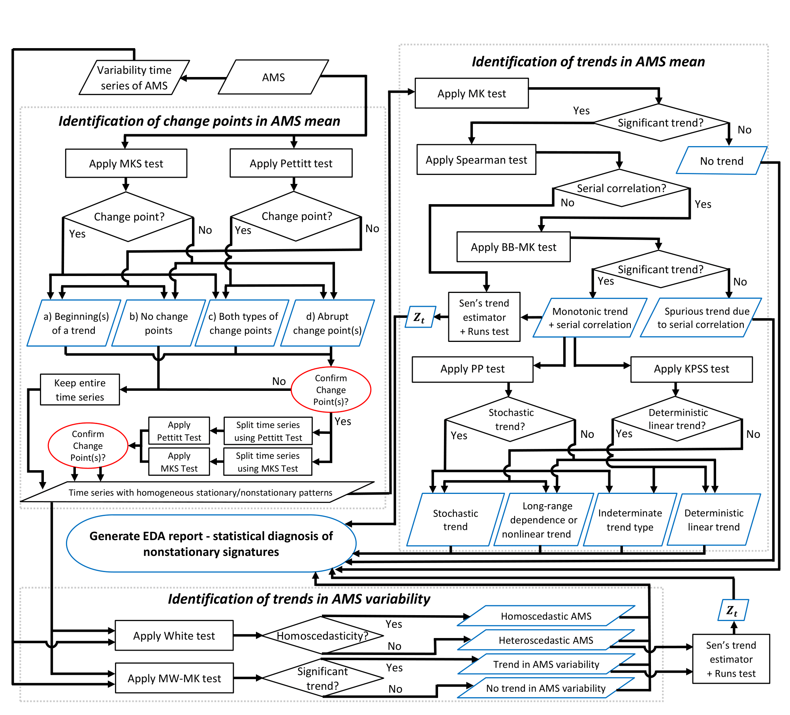

# Introduction to EDA

The exploratory data analysis (EDA) module assesses the feasibility of the stationarity assumption in the FFA framework.
It evaluates the presence of statistically significant nonstationary signatures, such as change points and deterministic temporal trends in the mean or variability of the annual maximum series.
Attributing nonstationarity to its drivers is important for selecting the appropriate FFA approach with greater confidence.

The current EDA workflow is shown below:

