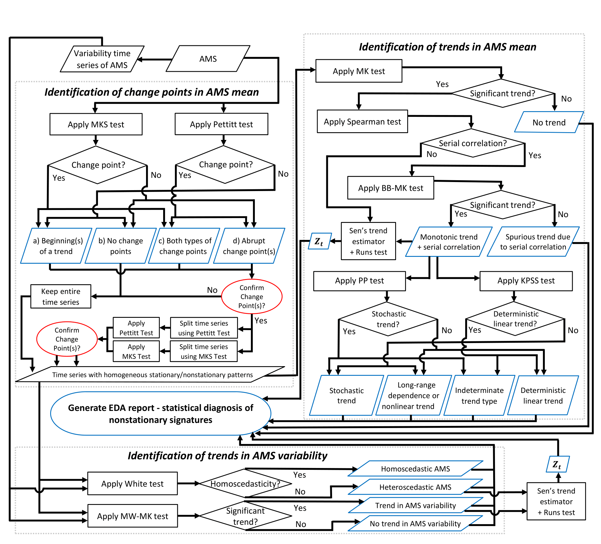

# EDA Framework

The exploratory data analysis (EDA) module of the flood frequency analysis (FFA) framework contains a collection of statistical tests for annual maximum streamflow (AMS) data.
These tests are performed in a specific order to accomplish the four goals listed below:

1. Identify change points ("jumps" or "kinks") in the AMS data.
2. Identify [autocorrelation](https://en.wikipedia.org/wiki/Autocorrelation) in the AMS data.
3. Identify trends in the mean value of the AMS data.
4. Identify trends in the variance of the AMS data.

A diagram showing the current EDA framework is shown below:

## BB-MK Test

The **Block Bootstrap Mann-Kendall (BB-MK) Test** is used to assess whether there is a statistically significant monotonic trend in a time series. The BB-MK test is insensitive to [autocorrelation](https://en.wikipedia.org/wiki/Autocorrelation), which is known to produce false positives in the [MK test](#mann-kendall-test).

- Null hypothesis: There is no monotonic trend.
- Alternative hypothesis: There is a monotonic upwards or downwards trend.

To carry out the BB-MK test, we rely on the results of the MK test and Spearman test.

1. Compute the MK test statistic.
2. Find the least insignificant lag $k$ using the Spearman test.
3. Resample from the original time series in blocks of size $k+1$ without replacement.
4. Estimate the MK test statistic for each bootstrapped sample.
5. Derive the empirical distribution of the MK test statistic from the bootstrapped statistics.
6. Estimate the significance of the observed test statistic using the empirical distribution.

### Example Plot

## KPSS Test

The **KPSS Test** is used to identify if an autoregressive time series has a [unit root](https://en.wikipedia.org/wiki/Unit_root).

- Null hypothesis: The time series does not have a unit root and is _trend-stationary_.
- Alternative hypothesis: The time series has a unit root and is _non-stationary_.

Precisely, the autoregressive time series shown below has unit root if $\sigma_{v}^2 > 0$:

$$
\begin{align}
y_{t} &= \mu_{t} + \beta t +  \epsilon_{t} \\[5pt]
\mu_{t} &= \mu_{t-1} + v_{t} \\[5pt]
v_{t} &\sim \mathcal{N}(0, \sigma_{v}^2)
\end{align}
$$

Here is what each term in this formulation represents:

- $\mu_{t}$ is the _drift_, or the deviation of $y_{t}$ from $0$.
  Under the null hypothesis, $\mu_{t}$ is constant (since $v_{t}$ is constant).
  Under the alternative hypothesis, $\mu_t$ is a stochastic process with unit root.
- $\beta t$ is a _linear trend_, which represents deterministic non-stationarity (i.e. climate change).
- $\epsilon_{t}$ is _stationary noise_, corresponding to reversible fluctuations in $y_{t}$.
  In hydrology, $\epsilon_{t}$ represents fluctuations in streamflow due to random events (i.e. weather).
- $v_{t}$ is _random walk innovation_, or irreversible fluctuations in $\mu_{t}$.
  In hydrology, $v_{t}$ could represent randomness in industrial activity causing climate change.

To conduct the test, we fit a linear model to $y_{t}$ and get the residuals $\hat{r}_{t}$.
Then, we compute the cumulative partial-sum statistics $S_{k}$ using the following formula:

$$
S_{k} = \sum_{t=1}^{k} \hat{r}_{t}
$$

Under the null hypothesis, $S_{k}$ will behave like a random walk with finite variance.
If $y_{t}$ has a unit root, then the sums will "drift" too much.

Next, we estimate the long-run variance of the time series while adjusting for autocovariance.
To do this, we require the sample autocovariances $\gamma_{j}$ for up to $q$ lags, where:

$$
q = \left\lfloor \frac{3\sqrt{n}}{13} \right\rfloor
$$

The sample autocovariance $\gamma_{j}$ is a measure of the correlation between the time series $y_{t}$ and the shifted time series $y_{t-j}$.
Each sample autocovariance $\gamma_{j}$ for $j = 0, 1, \dots, q$ is computed as follows:

$$
\hat{\gamma}_{j} = \frac{1}{n} \sum_{t = j + 1}^{n} \hat{r}_{t}\hat{r}_{t-j}
$$

Finally, we estimate the long-run variance $\hat{\lambda}^2$ using a [Newey-West](https://en.wikipedia.org/wiki/Newey%E2%80%93West_estimator) style estimator.
This estimator corrects for the additional variability in $\epsilon_{t}$ caused by autocorrelation and heteroskedasticity.

$$
\hat{\lambda}^2 = \hat{\gamma}_{0} + 2\sum_{j=1}^{q} \left(1 - \frac{j}{q + 1} \right)  \gamma_{j}
$$

Then, we compute the test statistic $z_{\text{KPSS}}$ using the following formula:

$$
z_{\text{KPSS}} = \frac{1}{n^2\hat{\lambda }^2}\sum_{k=1}^{n}  S_{k}^2
$$

The test statistic $z_{\text{KPSS}}$ is not normally distributed.
Instead, we compute the p-value by interpolating the table of quantiles from [Hobjin et al. (2004)](https://doi.org/10.1111/j.1467-9574.2004.00272.x) shown below.

| Probability       | 0.90  | 0.95  | 0.975 | 0.99  |
| --------- | ----- | ----- | ----- | ----- |
| Quantile | 0.119 | 0.146 | 0.176 | 0.216 |

**Warning**: The interpolation procedure discussed above only works for $0.01 < p < 0.10$.
Therefore, p-values below $0.01$ and above $0.10$ will be truncated. 
It is also required that the significance level $\alpha$ is between $0.01$ and $0.10$.

## Mann-Kendall Test

The **Mann-Kendall Test** is used to assess whether there is a statistically significant monotonic trend in a time series.
The test requires that when no trend is present, the data is independent and identically distributed.

- Null hypothesis: There is no monotonic trend.
- Alternative hypothesis: There is a monotonic upwards or downwards trend.

Define $\text{sign} (x)$ to be $1$ if $x > 0$, $0$ if $x = 0$, and $-1$ otherwise.

The test statistic $S$ is defined as follows:

$$
S = \sum_{k-1}^{n-1}  \sum_{j - k + 1}^{n} \text{sign} (y_{j} - y_{k})
$$

Next, we need to compute $\text{Var}(S)$, which depends on the number of tied groups in the data.
Let $g$ be the number of tied groups and $t_{p}$ be the number of observations in the $p$-th group.

$$\text{Var}(S) = \frac{1}{18} \left[n(n-1)(2n + 1) - \sum_{p-1}^{g} t_{p}(t_{p} - 1)(2t_{p} + 5) \right]$$

Then, compute the MK test statistic, $Z_{MK}$, as follows:

$$
Z_{MK} = \begin{cases}
\frac{S-1}{\sqrt{\text{Var}(S)}} &\text{if } S > 0 \\
0 &\text{if }  S = 0 \\[4pt]
\frac{S+1}{\sqrt{\text{Var}(S)}} &\text{if } S < 0
\end{cases}
$$

For a two-sided test, we reject the null hypothesis if $|Z_{MK}| \geq Z_{1 - (\alpha/2) }$ and conclude that there is a statistically significant monotonic trend in the data. For more information, see [here](https://vsp.pnnl.gov/help/vsample/design_trend_mann_kendall.htm).

## Mann-Kendall-Sneyers Test

The **Mann-Kendall-Sneyers (MKS) Test** is used to identify the beginning of a trend in a time series:

- Null hypothesis: There are no change points in the time series.
- Alternative hypothesis: There are _one or more_ change points in the time series.

Define $\mathbb{I}(y_{i} > y_{j})$ to be $1$ if $y_{i} > y_{j}$ and $0$ otherwise.

Given a time series $y_{1}, \dots, y_{n}$, we compute the *progressive series* $S^{F}_{t}$:

$$
S^{F}_{t} = \sum_{i=i}^{t} \sum_{j=1}^{i-1} \mathbb{I}(y_{i} > y_{j})
$$

Next, we reverse the time series $y$.
This gives us a new time series $y'$ such that $y_{i}' = y_{n+1-i}$. 
Then we compute the *regressive series* $S^{B}_{t}$, where $\text{rev}$ indicates that the vector is reversed:

$$
S^{B}_{t} = \text{rev}\left( \sum_{i=i}^{t} \sum_{j=1}^{i-1} \mathbb{I}(y'_{i} > y'_{j})\right)
$$

Then, we compute the _normalized progressive series_ $UF_{t}$ and _normalized regressive series_ $UB_{t}$:

$$
UF_{t} = \frac{S^{F}_{t} - \mathbb{E}[S^{F}_{t}]}{\sqrt{\text{Var}\,(S^{F}_{t})}}, \quad
UB_{t} = \frac{S^{B}_{t} - \mathbb{E}[S^{B}_{t}]}{\sqrt{\text{Var}\,(S^{B}_{t})}}
$$

For both the progressive and regressive series, the expectation and variance is as follows:

$$
\mathbb{E}[S^{F}_{t}] = \mathbb{E}[S^{B}_{t}] = \frac{t(t-1)}{4}, \quad
\text{Var}(S^{F}_{t}) = \text{Var}(S^{B}_{t}) = \frac{t(t-1)(2t+5)}{72}
$$

Finally, we plot $UF_{t}$ and $UB_{t}$ with confidence bounds at the $\alpha/2$ and $1 - (\alpha /2))$ quantiles of the standard normal distribution, where $\alpha$ is the chosen significance level.
A crossing point between $UF_{t}$ and $UB_{t}$ that lies outside the confidence bounds indicates the start of the trend.

### Example Plot

## MW-MK Test

The **Moving Window Mann-Kendall (MW-MK) Test** is used to identify a statistically significant monotonic trend in the variances of an AMS time series.

- Null hypothesis: There is no significant trend in the variance of the AMS.
- Alternative hypothesis: There is a significant trend in the variance of the AMS.

To compute the AMS variances we use a moving window algorithm:

1. Let $w$ be the length of the moving window and $s$ be the step size.
2. Initialize the moving window at indices $[1, w]$.
3. Compute the sample standard deviation within the moving window.
4. Move the window forward by $s$ indices.
5. Check if last index in the window is greater than the length of the data. If it is, all moving window variances have been computed. Otherwise, go to step (3).

Then, we perform the Mann-Kendall Test on the time series of variances.

For more information about the Mann-Kendall test, see [here](#mann-kendall-test).

## Pettitt Test

The **Pettitt Test** is used to identify abrupt changes in the mean of a time series.

- Null hypothesis: There are no abrupt changes in the time series mean.
- Alternative hypothesis: There is _one_ abrupt change in the time series mean.

Define $\text{sign}(x)$ to be $1$ if $x > 0$, $0$ if $x = 0$, and $-1$ otherwise.

Given a time series $y_{1}, \dots, y_{n}$, compute the following test statistic:

$$
U_{t} = \sum_{i=1}^{t} \sum_{j=t+1}^{n} \text{sign} (y_{j} - y_{i}), \quad K = \max_{t}|U_{t}|
$$

The value of $t$ such that $U_{t} = K$ is a _potential change point_. The p-value of the potential change point can be approximated using the following formula for a one-sided test:

$$
p \approx \exp \left(-\frac{6K^2}{n^3 + n^2}\right)
$$

If the p-value is less than the significance level $\alpha$, we reject the null hypothesis and conclude that there is evidence for an abrupt change in the mean at the potential change point.

### Example Plot

## Phillips-Perron Test

The **Phillips-Perron (PP) Test** is used to identify if an autoregressive time series $y_t$ has a [unit root](https://en.wikipedia.org/wiki/Unit_root).

- Null hypothesis: $y_{t}$ has a _unit root_ and is thus _non-stationary_.
- Alternative hypothesis: $y_{t}$ does not have a unit root and is _trend-stationary_.

Precisely, let $x_{t}$ be an [AR(1)](https://en.wikipedia.org/wiki/Autoregressive_model) model.
Let $y_{t}$ be a function of $x_{t}$ with drift $\beta_{0}$ and trend $\beta_{1} t$.

$$
\begin{align}
y_{t} &= \beta_{0} + \beta_{1} t + x_{t} \\[5pt]
x_{t} &= \rho x_{t-1} + \epsilon_{t}
\end{align}
$$

- If $\rho = 1$, then $x_t$ and hence $y_t$ has a _unit root_ (null hypothesis).
- If $\rho < 1$, then $y_t$ is _trend stationary_ (alternative hypothesis).

To perform the test, we begin by fitting an autoregressive linear model to $y_{t}$.
Let $\hat{r}_{t}$ be the residuals of this model.
From this model, we can determine $\hat{\rho}$ (the estimated coefficient on $y_{t-1}$) and $\text{SE}(\hat{\rho})$ (its standard error).
Let $\hat{\sigma}^2$ be the variance of the residuals, computed using the following formula:

$$
\hat{\sigma^2} = \frac{1}{n - 3} \sum_{t=1}^{n} \hat{r}_{t}^2
$$

In the equation above, $n$ is the number of data points in the sample.
We have $n-3$ degrees of freedom since there are three parameters in the autoregressive model ($\beta_{0}$, $\beta_{1}$, and $\rho$).

Next, we compute the sample autocovariances $\gamma_{j}$ for up to $q$ lags, where:

$$
q = \left\lfloor \sqrt[4]{\frac{n}{25}}\right\rfloor
$$

The sample autocovariance $\gamma_{j}$ is a measure of the correlation between the time series $y_{t}$ and the shifted time series $y_{t-j}$.
Each sample autocovariance $\gamma_{j}$ for $j = 0, 1, \dots, q$ is computed as follows:

$$
\hat{\gamma}_{j} = \frac{1}{n} \sum_{t = j + 1}^{n} \hat{r}_{t}\hat{r}_{t-j}
$$

Finally, we estimate the long-run variance $\hat{\lambda}^2$ using a [Newey-West](https://en.wikipedia.org/wiki/Newey%E2%80%93West_estimator) style estimator.
This estimator corrects for the additional variability in $\epsilon_{t}$ caused by autocorrelation and heteroskedasticity.

$$
\hat{\lambda}^2 = \hat{\gamma}_{0} + 2\sum_{j=1}^{q} \left(1 - \frac{j}{q + 1} \right)  \gamma_{j}
$$

Then, we compute the test statistic $z_{\rho}$ using the following formula:

$$
z_{\rho } = n(\hat{\rho} - 1) - \frac{n^2 \text{SE}(\hat{\rho})^2}{2 \hat{\sigma}^2}(\hat{\lambda }^2 - \hat{\gamma}_{0})
$$

The test statistic $z_{\rho}$ is not normally distributed.
Instead, we compute the p-value by interpolating a table from Fuller, W. A. (1996).
This table is shown below for sample sizes $n$ and probabilities $p$:

| $n$ \ $p$ | 0.01  | 0.025 | 0.05  | 0.10  | 0.50  | 0.90  | 0.95  | 0.975 | 0.99  |
| --------- | ----- | ----- | ----- | ----- | ----- | ----- | ----- | ----- | ----- |
| 25        | -22.5 | -20.0 | -17.9 | -15.6 | -8.49 | -3.65 | -2.51 | -1.53 | -0.46 |
| 50        | -25.8 | -22.4 | -19.7 | -16.8 | -8.80 | -3.71 | -2.60 | -1.67 | -0.67 |
| 100       | -27.4 | -23.7 | -20.6 | -17.5 | -8.96 | -3.74 | -2.63 | -1.74 | -0.76 |
| 250       | -28.5 | -24.4 | -21.3 | -17.9 | -9.05 | -3.76 | -2.65 | -1.79 | -0.83 |
| 500       | -28.9 | -24.7 | -21.5 | -18.1 | -9.08 | -3.76 | -2.66 | -1.80 | -0.86 |
| 1000      | -29.4 | -25.0 | -21.7 | -18.3 | -9.11 | -3.77 | -2.67 | -1.81 | -0.88 |

**Warning**: The interpolation procedure discussed above only works for $0.01 < p$.
Therefore, p-values below $0.01$ will be truncated and it is required that $0.01 < \alpha$.

## Runs Test

After computing the regression line using [Sen's trend estimator](eda.md#sens-trend-estimator), we use the **Runs Test** to determine whether the residuals from the regression are random.
If the Runs test identifies non-randomness in the residuals, it is a strong indication that the non-stationarity in the data is not linear.

- Null hypothesis: The residuals are distributed randomly.
- Alternative hypothesis: The residuals _are not_ distributed randomly.

Prior to applying the Runs test, the data is categorized based on whether it is above ($+$) or below $(-)$ the median. 
Any data points equal to the median are removed.
Then, we compute the number of contiguous blocks of $+$ or $-$ (known as _runs_) in the data.

> **Example**: Suppose that after categorization, the sequence of data is as follows:
>
> $$
> +++--+++-+-
> $$
>
> This sequence has six runs with length $(3, 2, 3, 1,1, 1)$.

Let $R$ be the number of runs in $N$ data points (with category counts $N_{+}$ and $N_{-}$).

Then, under the null hypothesis, $R$ is asymptotically normal with:

$$
\mathbb{E}[R] = \frac{2N_{+}N_{-}}{N} + 1, \quad
\text{Var}(R) = \frac{2N_{+}N_{-}(2N_{+}N_{-} - N)}{N^2(N - 1)}
$$

### Example Plot

## Sen's Trend Estimator

**Sen's Trend Estimator** is used to estimate the slope of a regression line.
Unlike [Least Squares](https://en.wikipedia.org/wiki/Least_squares), Sen's trend estimator uses a non-parametric approach which makes it robust to outliers.

To compute Sen's trend estimator we use the following procedure:

1. Iterate over all pairs of data points $(x_{i}, y_{i})$ and $(x_{j}, y_{j})$.
2. If $x_{i} \neq  x_{j}$, compute the slope $(y_{j} - y_{i})/(x_{j} - x_{i})$ and add it to a list $S$.
3. Sen's trend estimator $\hat{m}$ is the median of $S$.

After computing $\hat{m}$, we can estimate the $y$-intercept $b$ by the median of $y_{i} - \hat{m}x_{i}$ for all $i$.

### Example Plot

## Spearman Test

The **Spearman Test** is used to identify autocorrelation in a time series $y_{t}$.
A _significant lag_ is a number $i$ such that the correlation between $y_{t}$ and $y_{t-i}$ is statistically significant.
The _least insignificant lag_ is the largest $i$ such that all $j < i$ are significant lags.

- Null hypothesis: The least insignificant lag is $0$.
- Alternative hypothesis: The least insignificant lag is greater than $0$.

To carry out the Spearman test, we use the following procedure:

1. Compute Spearman's correlation coefficient $\rho_{i}$ for $y_{t}$ and $y_{t-i}$ for all $0 \leq  i <  n$.
2. Determine the $p$-value $p_{i}$ for each correlation coefficient $\rho _{i}$.
3. Iterate through $p_{i}$ to find the largest $i$ such that $p_{j} \leq  \alpha$ for all $j \leq i$.
4. The value of $i$ found in (3) is the least insignificant lag at confidence level $\alpha$.

**Remark**: To compute the $p$-value of a correlation coefficient $\rho _{i}$, first compute:

$$
t_{i}= \rho_{i} \sqrt{\frac{n-2}{1 - \rho _{i}^2}}
$$

Then, the test statistic $t_{i}$ has the $t$-distribution with $n-2$ degrees of freedom.

For more information, see the Wikipedia pages on [Autocorrelation](https://en.wikipedia.org/wiki/Autocorrelation) and [Spearman's Rho](https://en.wikipedia.org/wiki/Spearman%27s_rank_correlation_coefficient).

### Example Plot

## White Test

The **White Test** is used to detect changes in the variance of a time series.

- Null hypothesis: The variance of the time series is constant (homoskedasticity).
- Alternative hypothesis: The variance of the time series is time-dependent (heteroskedasticity).

Consider a simple linear regression model:

$$y_{i} = \beta_{0} + \beta_{1} x_{i} + \epsilon_{i}$$

Use ordinary least squares to fit the model. Then compute the squared residuals:

$${\hat{r}}_{i}^{2} = (y_{i} - \hat{y}_{i})^{2}$$

Next, fit an auxillary regression model to the squared residuals.
This model includes each regressor, the square of each regressor, and the cross products between all regressors.
Since $x$ is the only regressor, the regression model is simply:

$${\hat{r}}_{i}^{2} = \alpha_{0} + \alpha_{1}x_{i} + \alpha_{2}x_{i}^{2} + u_{i}$$

Next, we compute the [coefficient of determination](https://en.wikipedia.org/wiki/Coefficient_of_determination) $R^2$ for the auxillary model.
The test statistic is $nR^2 \sim \chi_{d}^2$, where $n$ is the number of observations and $d = 2$ is the number of regressors, excluding the intercept.
If $nR^2 > \chi^2_{1-\alpha, d}$, we reject the null hypothesis and conclude that the time series exhibits heteroskedasticity.
