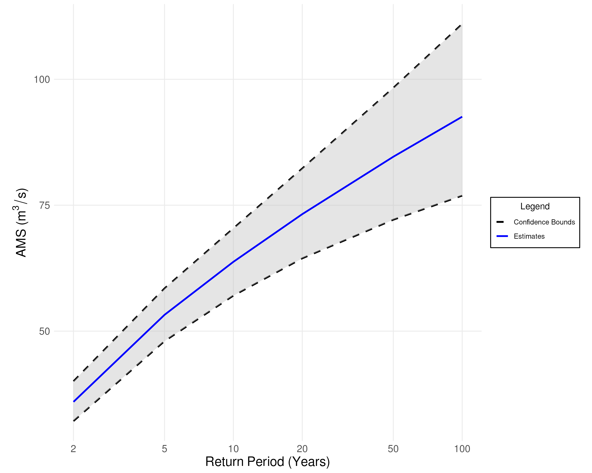
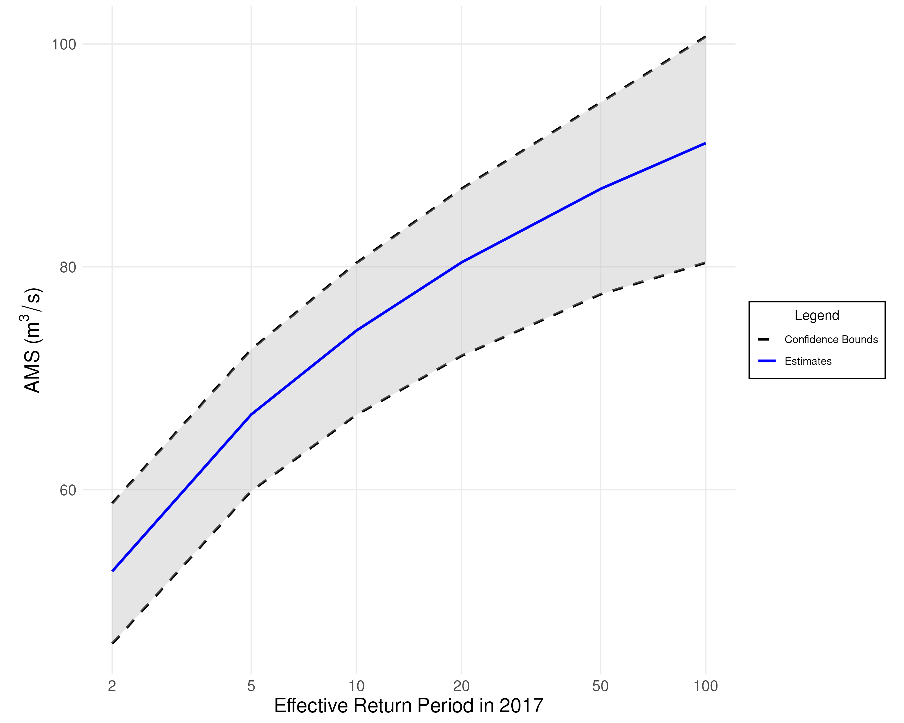

# Flood Frequency Analysis (FFA)

## Overview

<<<<<<< HEAD
**Flood Frequency Analysis (FFA)** uses a _probability distribution_ fitted to extreme streamflow observations (e.g., annual maxima) to estimate the _recurrence likelihood_ of floods. To perform FFA, we require a [probability model](model-selection.md) and corresponding [parameter estimates](parameter-estimation.md) based on the data.

FFA relates flood peak magnitudes $Q$ to their expected frequency of occurrence, expressed as a **return period**. For example, a flood with a 10-year return period—commonly referred to as a **10-year flood**—has a 1-in-10 chance of being equalled or exceeded in any given year. This corresponds to an **annual exceedance probability** $p_e = 0.1$.  
Since the FFA Framework uses **annual maxima** data, this equates to the 90th percentile (i.e., the $0.90$ quantile) of the fitted probability distribution.
=======
FFA uses a _fitted probability distribution_ to make predictions about the _frequency_ of extreme streamflow events (i.e., floods).
To do this, we require a [probability model](model-selection.md) [fitted](parameter-estimation.md) to the sample.

Typically, we describe the severity of floods in terms of their _return period_.
Suppose we have a flood, referred to as $Q$.
If we expect to see a flood _at least as severe as_ $Q$, every ten years, then we say that $Q$ is a _ten-year flood_.
Since the FFA framework uses _annual_ maximum series data, a ten-year flood corresponds to an _exceedance probability_ of $0.1$.
Note that an exceedance probability of $0.1$ corresponds to the $1 - 0.1 = 0.90$ quantile (non-exceedance probability) of our distribution.
Here is a table of the return periods, exceedance probabilities, and quantiles used in the FFA framework:
>>>>>>> development

Here is a summary of return periods, exceedance probabilities, and associated distribution quantiles used in the FFA framework:

| Return Period ($T$) | Exceedance Probability ($p_e$)   | Quantile ( $F(q)$ )|
|---------------------|----------------------------------|-------------------|
| 2 Years             | 0.50                             | 0.50              |
| 5 Years             | 0.20                             | 0.80              |
| 10 Years            | 0.10                             | 0.90              |
| 20 Years            | 0.05                             | 0.95              |
| 50 Years            | 0.02                             | 0.98              |
| 100 Years           | 0.01                             | 0.99              |

Let $F(q)$ be the cumulative distribution function (CDF) of the fitted model. This function maps flood magnitudes to exceedance probabilities: $p_e = 1 - F(q)$.  
To estimate flood magnitudes for a given exceedance probability, we use the **inverse CDF**, or **quantile function**: $\hat{q} = F^{-1}(p_e)$.

<<<<<<< HEAD

### Example Plot

FFA results are typically visualized with return period on the $x$-axis and flood magnitude on the $y$-axis. These plots can be interpreted in two directions:

1. **Estimate flood magnitude** for a given return period  
   _Example_: A 50-year flood is estimated to be about $85\ \text{m}^3/\text{s}$.

2. **Estimate return period** for a given flood magnitude  
   _Example_: A streamflow of $50\ \text{m}^3/\text{s}$ is expected to occur roughly every 4 years.
=======
Suppose our fitted probability distribution has a cumulative distribution function $F(x)$.
The function $F(x)$ maps annual maximum flood magnitudes to quantiles/non-exceedance probabilities.
However, we want to determine flood magnitudes from the quantiles/non-exceedance probabilities, so we use the inverse of the cumulative distribution $F^{-1}(x)$ instead.
The function $F^{-1}(x)$ is also known as the **Quantile Function**.

### Example Plot

We typically present the results of a flood frequency analysis as a graph with time on the $x$-axis and annual maximum series on the $y$-axis.
There are two ways to read a graph like this:

1. Estimate the severity of a flood for a given time period.
    From the graph below, we could determine that every 50 years, we can expect a flood of approximately $85\text{m}^3/\text{s}$.
2. Estimate the frequency of a flood for a given severity.
    From the graph below, we could determine that a flood of $50\text{m}^3/\text{s}$ or higher will occur every 4 years.
>>>>>>> development

**Note**: For an explanation of the confidence bounds in this plot, see [Uncertainty Quantification](uncertainty-quantification.md).

<<<<<<< HEAD
---

## Handling Nonstationarity

A distribution is considered **nonstationary** if its statistical properties (e.g., mean or variance) change over time. In such cases, the quantile function becomes time-dependent: $F^{-1}(p_e, t)$.  
As a result, return levels and exceedance probabilities vary with time, and a static return period curve is no longer valid.

To address this, the FFA framework computes **effective return periods**, which yield flood estimates for a specific year based on the time-varying distribution.
=======
## Handling Nonstationarity

We say that a distribution is **Nonstationary** if its mean or variance (or both) are changing over time.
Under nonstationarity, the quantile function of our fitted probability distribution is also a function of time $F^{-1}(x, t)$.
This means that our estimates and return periods also vary with time, so we cannot report a single set of estimates and confidence intervals as we did in the plot above. 
For nonstationary models, the FFA framework computes **Effective Return Periods**, which are estimates based on the quantile function *for a specific year*.
>>>>>>> development

### Example Plot

The plot below illustrates **effective return levels** for the year 2017.

<<<<<<< HEAD
> **Note**: A 100-year effective return level does *not* imply that such a flood is expected to occur once in the next 100 years. It means that in **the year 2017**, the probability of exceeding that flood magnitude is 1 in 100.

=======
**Note**: A flood with an effective return period of 100 years *will not* occur every 100 years due to the nonstationarity of the model.
Instead, an effective return period of 100 years means that *in the anchor year* (2017), we predict there is a $1/100$ probability of a flood with the given severity. 

>>>>>>> development
