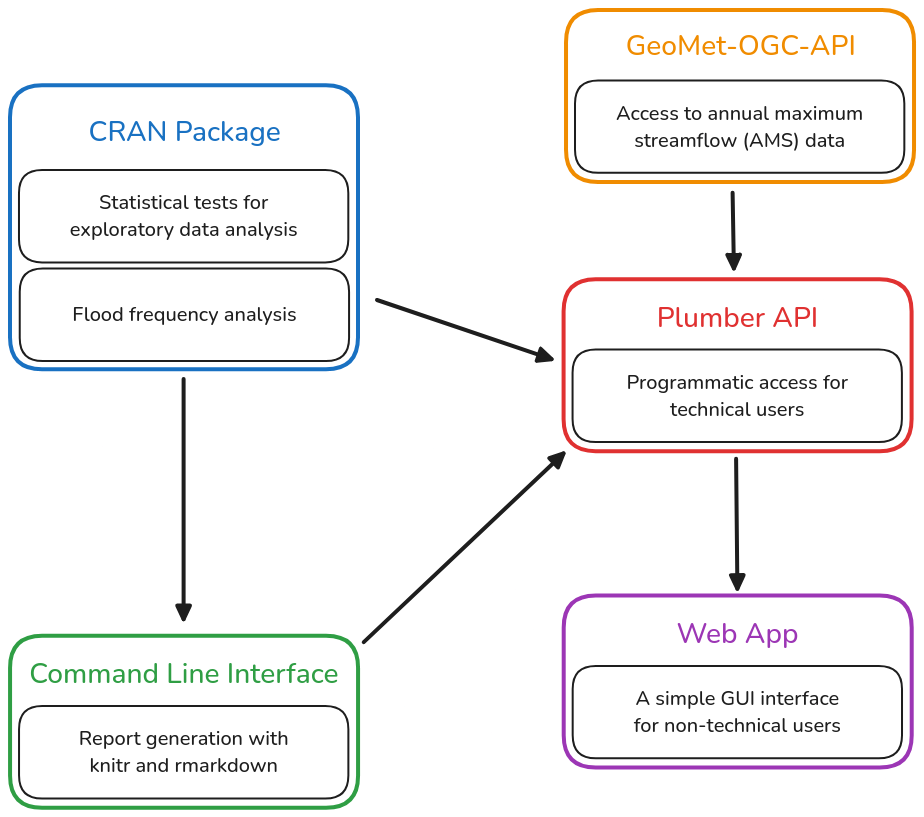

# Goals

[Vidrio-Sahagún et al. (2024)](https://doi.org/10.1080/07011784.2025.2462603) identified a number of issues with FFA research in Canada. Our framework aims to address these issues. In particular, we hope to achieve:

- **Standardization**: The United States uses a standardized distribution (LP3) and parameter estimation method (expected moments) for FFA. However, Canada does not provide such guidance. By developing this framework, we hope to limit subjectivity in flood estimation.
- **Reproducibility**: A significant fraction of FFA studies in Canada do not provide essential information for reproduction, such as the exploratory data analysis (EDA) performed, the distribution selection mechanism, and even the probability distribution itself. Our framework will ensure all of this information is available.
- **Statistical Rigour**: Historically, many FFA studies have not performed uncertainty quantification, which makes it difficult to draw accurate conclusion from the results. Our framework automatically performs uncertainty analysis to quantify potential errors.
- **Research-to-Practice Translation**: The disorganization of FFA research in Canada makes it difficult for regulatory agencies to access cutting-edge advancements in FFA methodologies. By providing a common set of techniques for modellers to use, we hope to bridge the gap between research and practice. 

Development is guided by the following principles:

- **Software Freedom**: Our framework is built on free and open source software.
- **Modularity**: Users are allowed to use as much or as little of the framework as they like.
- **Interoperability**: Our framework can be seamlessly integrated with other flood models.
- **Flexibility**: Users can tailor their analysis to the nuances of individual watersheds.
- **Clarity**: The source code is easy to read and understand without confusing tricks.
- **Robustness**: The framework can handle datasets with small sample sizes or missing values.
- **Speed**: The framework is fast enough to handle batch processing of many datasets.

## Architecture

We believe the following architecture will allow us to achieve the goals listed above: 

### CRAN Package

Our CRAN package will contain a suite of statistical tests, distribution selection mechanisms, and probability distributions for FFA.
Many of the statistical tests used in our framework are sparsely documented, so providing an implementation of these tests in R will benefit the statistical community at large.

### Command Line Interface  

The command line interface (CLI) will allow technical users to programmatically generate reports and run statistical models.
Additionally, the CLI will make it possible to run each component of the FFA framework separately.
This will allow advanced users to design custom analysis pipelines. 
 
### Plumber API

An API (built with [plumber.R](https://www.rplumber.io/)) will provide programmatic access to our framework.

### Web App

Finally, we will a develop a web application on top of the Plumber API which will give new users a simple GUI interface for accessing our framework. 
We hope that this web application will make it easier for beginner modellers to learn about FFA.

## Non-Goals

**Warning**: This list is not final and will be updated as development continues.

This software *will not* support the following features:

- Explanations of FFA itself. We assume the modeller is familiar with basic hydrological concepts. 
- Handling different time periods (i.e. monthly maximum streamflow data).
- Transforming the AMS data in any way (i.e. removing serial correlation, removing trends).

