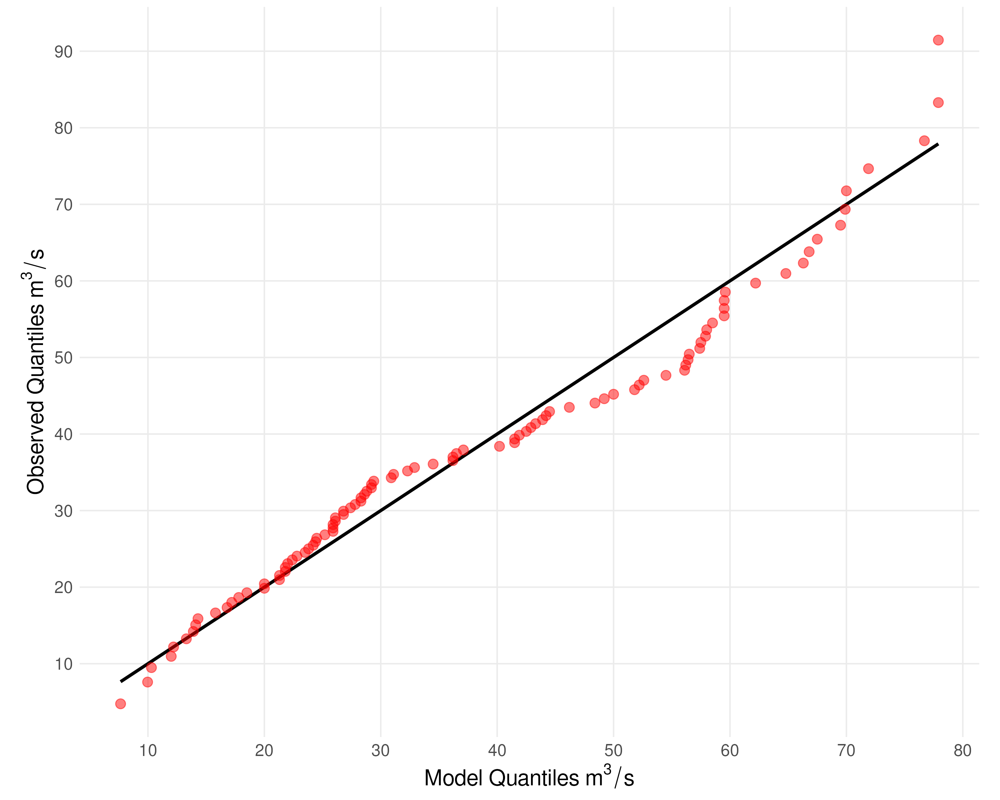

# Model Assessment

## Nonparametric Models

A **Plotting Position** is a non-parametric estimator used to derive empirical exceedance probabilities. By using the plotting position, we can evaluate the quality of our parametric model. To compute the plotting position, arrange the sample observations in descending order of magnitude: $x_{n:n} \geq  \dots  \geq  x_{1:n}$. Then, the empirical exceedance probabilities are given by the following formula:

$$
p_{i:n} = \frac{i-a}{n+1 - 2a}, \quad i \in \{1, \dots , n\}
$$

The coefficient $a$ depends on the plotting position formula:

| Formula    | $a$     | Simplified Equation                  |
| ---------- | ------- | ------------------------------------ |
| Weibull    | $0$     | $p_{i:n} = \frac{i}{n +1}$           |
| Blom       | $0.375$ | $p_{i:n} = \frac{i-0.375}{n + 0.25}$ |
| Cunnane    | $0.4$   | $p_{i:n} = \frac{i-0.4}{n+0.2}$      |
| Gringorten | $0.44$  | $p_{i:n} = \frac{i-0.44}{n + 0.12}$  |
| Hazen      | $0.5$   | $p_{i:n} = \frac{i-0.5}{n}$          |

By default, the FFA framework uses the Weibull formula, which is unbiased.

## Accuracy Statistics 

### $R^2$ - Coefficient of Determination

To compute the $R^2$ statistic, we perform a linear regression of the annual maximum series data against the predictions of the parametric model at the plotting positions.
The $R^2$ statistic describes how well the parametric model captures variance in the data. 
Higher is better.

The plot below shows the deviation of the estimated quantiles (red dots), from the data (black line).



### RMSE - Root-Mean Squared Error

The `RMSE` statistic describes the average *squared* difference between the data and the predictions of the parametric model.
Lower is better.

### Bias

The `Bias` statistic describes the average difference between the data and the predictions of the parametric model.
A positive bias indicates that the model tends to *overestimate* the data while a negative bias indicates that the model tends to *underestimate* the data.

## Information Criterion 

The **Akaike Information Criterion** (`AIC`) and **Bayesian Information Criterion** (`BIC`) describe the quality of a model based on the error (`RMSE`) and the number of parameters (`n_theta`).
Better models have a lower `AIC`/`BIC`, which indicates that they have *less* parameters and *lower* error.

```R
AIC <- (n * log(RMSE)) + (2 * n_theta)
BIC <- (n * log(RMSE)) + (log(n) * n_theta)
```

The Akaike/Bayesian information criterion can also be computed using the maximum log-likelihood from [maximum likelihood estimation](parameter-estimation.md#maximum-likelihood-mle). 
These statistics are reported as `AIC_MLL` and `BIC_MLL`.

```R
AIC_MLL <- (n * log(MLL)) + (2 * n_theta)
BIC_MLL <- (n * log(MLL)) + (log(n) * n_theta)
```

## Uncertainty Statistics

The FFA framework uses three statistics to assess the uncertainty in flood quantile estimates:

- `AW` captures **precision** (narrower confidence intervals are better).
- `POC` captures **reliability** (higher coverage of observations is better).
- `CWI` is a composite measure balancing both precision and reliability (lower is better).

We use these metrics together to evaluate the robustness of the flood frequency analysis.

### AW – Average Width

`AW` is the average width of the interpolated confidence intervals across return periods of interest.
A smaller `AW` indicates more **precise** quantile estimates.
To compute `AW`, we use log-linear interpolation to estimate the confidence intervals of the empirical exceedance probabilities from the confidence intervals computed during [uncertainty quantification](uncertainty-quantification.md).

### POC – Percent of Coverage

 `POC` is the percentage of observed quantiles that fall within their corresponding confidence intervals.
A higher `POC` indicates greater **reliability** of the confidence intervals.

### CWI – Confidence Width Indicator

`CWI` is a composite metric that penalizes wide and/or poorly calibrated confidence intervals.

- A lower `CWI` is better.
- Wide intervals and low coverage increase the penalty.
- Ideal confidence intervals are both narrow and well-calibrated, resulting in a low `CWI`.

The `CWI` is computed using the following formula, where `alpha` is the significance level.

```r
CWI <- AW * exp((1 - alpha) - POC / 100)^2;
```
