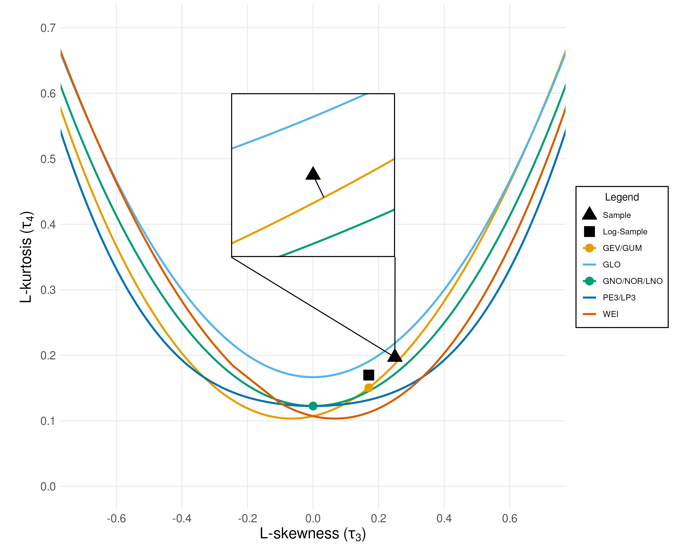

# Model Selection

Our framework uses the method of L-moment ratios to choose a suitable probability model for frequency analysis.
This technique involves comparing the L-moments of the data with the known L-moments of various probability distributions.

## An Introduction to L-Moments

**Definition**: The **$k$-th Order Statistic** of a statistical sample is its $k$-th smallest value.

**Definition**: The **$r$-th Population L-moment** $\lambda_{r}$ is a linear combination of the expectation of the order statistics. Let $X_{k:n}$ be the $k$-th order statistic from a sample of size $n$. Then,

$$
\lambda_{r} = \frac{1}{r} \sum_{k=0}^{r-1} (-1)^{k} \binom{r-1}{k} \mathbb{E}[X_{r-k:r}]
$$

**Definition**: A **Probability Weighted Moment** (PWM) encodes information about a value's position on the cumulative distribution function. The $r$-th PWM, denoted $\beta_{r}$, is:

$$
\beta_{r} = \mathbb{E}[X \cdot  F(X)^{r}]
$$

For an ordered sample $x_{1:n} \leq  \dots  \leq  x_{n:n}$, the sample PWM is often estimated as:

$$
b_{r} = \frac{1}{n} \sum_{i=1}^{r} x_{i:n} \left(\frac{i-1}{n-1}\right) ^{r}
$$

**Remark**: The first four sample L-moments can be computed as linear combinations of the PWMs:

$$
\begin{aligned}
l_{1} &= b_{0} \\
l_{2} &= 2b_{1} - b_{0} \\
l_{3} &= 6b_{2} - 6b_{1} + b_{0} \\
l_{4} &= 20b_{3} - 30b_{2} + 12b_{1} - b_{0}
\end{aligned}
$$

The L-moments are used to compute the **Sample L-variance** $t_{2}$, **Sample L-skewness** $t_{3}$ and the **Sample L-kurtosis** $t_{4}$ using the following formulas:

$$
\begin{aligned}
t_{2} &= l_{2} / l_{1} \\
t_{3} &= l_{3} / l_{2} \\ 
t_{4} &= l_{4} / l_{2}
\end{aligned}
$$ 

Then, we compare these statistics, specifically the L-skewness and L-kurtosis to their theoretical values (given [here](distributions.md)) using one of three different metrics to select a distribution.

**Note**: Probability distributions with less than three parameters have constant L-skewness $\tau_{3}$ and L-kurtosis $\tau_{4}$ regardless of their parameters.
The L-skewness and L-kurtosis of probability distributions with three parameters is a function of the shape parameter $\kappa$.
The notation $\tau_{3}(\kappa)$ and $\tau_{4}(\kappa)$ refers to the L-skewness and L-kurtosis *curves* for the three parameter distributions.

### Example Plot

Shown below are the L-moment curves of the `GEV`,`GLO`,`GNO`,`PE3`/`LP3`, and `WEI` distributions.
The L-moment ratios of the two parameter distributions `GUM` and `NOR`/`LNO`.
This example uses the "L-distance" selection metric.
The zoomed-in region shows that the GEV distribution is most similar to the sample L-moments.

## Selection Metrics

### L-Distance

Compare the euclidean distance between the sample L-skewness and sample L-kurtosis $(t_{3}, t_{4})$ and the known L-moment ratios $(\tau_{3}, \tau_{4})$ for each candidate distribution.
For probability distributions with three parameters, we use the *minimum distance* between the L-moment ratio curve $(\tau _{3}(\kappa ), \tau _{4}(\kappa ))$and the L-moment ratios of the sample $(t_{3}, t_{4})$.

### L-Kurtosis

For two-parameter probability distributions, simply compare the difference between the sample L-kurtosis and the theoretical L-kurtosis using the metric $|\tau_{4} - t_{4} |$.
For three-parameter distributions, we first identify the shape parameter $\kappa^{*}$ such that $t_{3} = \tau _{3}(\kappa ^{*})$.
Then, compare the difference between the sample L-kurtosis and the theoretical L-kurtosis using the metric $|\tau_{4}(\kappa ^{*}) - t_{4} |$.

### Z-statistic

The Z-statistic selection metric is calculated as follows (for three parameter distributions):

1. Fit the four-parameter Kappa (K4D) distribution to the data using $t_{2}$, $t_{3}$, and $t_{4}$.
2. Generate $N_{\text{sim}}$ bootstrap samples from the fitted K4D distribution.
3. Calculate the sample L-kurtosis $t_{4}^{[i]}$ of each synthetic dataset.
4. Calculate the bias and standard deviation of the bootstrap distribution:

    $$
    B_{4} = N_{\text{sim} }^{-1} \sum_{i = 1}^{N_{\text{sim} }} \left(t_{4}^{[i]} - t_{4}^{s}\right)
    $$

    $$
    \sigma _{4} = \left[(N_{\text{sim} } - 1)^{-1} \left\{\sum_{i - 1}^{N_{\text{sim} }} \left(t_{4}^{[i]} - t_{4}^{s}\right)^2 - N_{\text{sim} } B_{4}^2\right\} \right] ^{\frac{1}{2}}
    $$

5. Identify the shape parameter $\kappa^{*}$ such that $t_{3} = \tau _{3}(\kappa ^{*})$.
6. Use bootstrap distribution to compute the Z-statistic for each distribution:

    $$
    z = \frac{\tau_{4} (\kappa ^{*}) - t_{4} + B_{4} }{ \sigma _{4}}
    $$ 

7. Choose the distribution with the *smallest* Z-statistic.

## Handling Non-Stationarity

There are three non-stationary scenarios that can be identified during EDA:

1. `10`/`100`: Significant trend in the mean only.
2. `01`/`010`: Significant trend in the variance only.
3. `11`/`110`: Significant trend in both the mean and variance.

To determine the best probability distribution for non-stationary data, we *decompose* the data into stationary and non-stationary components and then use one of the methods described above.

### Decomposition (Scenario 1)

1. Use [Sen's Trend Estimator](eda.md#sens-trend-estimator) to identify the slope $b_{1}$ and intercept $b_{0}$ of the trend. 
2. Detrend the data by subtracting the linear function $(b_{1} \cdot \text{Covariate})$ from the data, where the *covariate* is a value between $[0, 1]$ derived from the index.
3. If necessary, enforce positivity by adding a constant such that $\min(\text{data}) = 1$ .

### Decomposition (Scenario 2)

1. Use a moving-window algorithm to compute the variance of the data. 
2. Use [Sen's Trend Estimator](eda.md#sens-trend-estimator) to identify the slope $c_{1}$ and intercept $c_{0}$ of the trend in the variance. 
3. Normalize the data to have mean $0$, then divide out the scale factor $g_{t}$.

    $$
    g_{t} = \frac{(c_{1} \cdot  \text{Covariate} ) + c_{0}}{c_{0}}
    $$ 

4. Add back the long-term mean $\mu$, and then ensure positivity as in Scenario 1.

### Decomposition (Scenario 3)

1. Remove the linear (additive) trend exactly as in Scenario 1.
2. On that detrended series, compute a rolling‐window STD series and fit its trend.
3. Divide the detrended data by the time-varying scale factor $g_{t}$ (as in Scenario 2).
4. Shift to preserve the series mean and ensure positivity.

